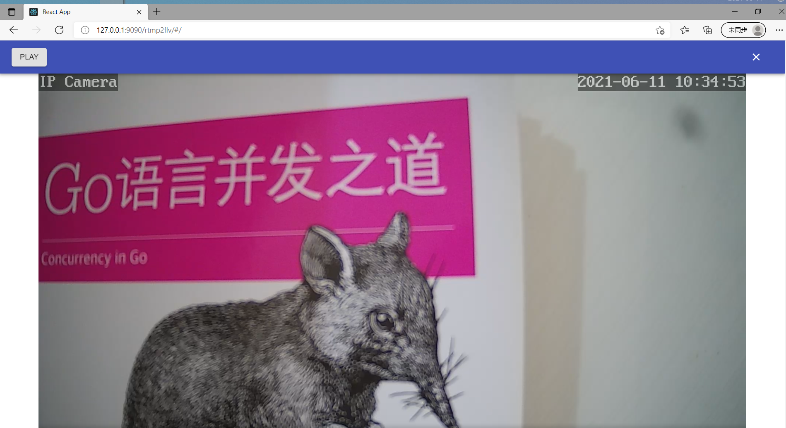

**关于连接postgres报错（问题已修复）**   
由于引入包不支持新版本的pg加密方式，暂时解决方法配置程序所在机器的ip免密登录    
若程序和数据同在一台机器，找到pg_hba.conf文件，修改通过127.0.0.1登录的不需要密码
```
host all all 127.0.0.1/32 trust
```
之后配置文件连接去掉密码

#### rtmp2flv



##### 项目功能：

1. rtmp转httpflv播放
2. rtmp视频录像，录像文件为flv格式

##### 运行说明：

1. 下载[程序文件](https://github.com/hkmadao/rtmp2flv/releases)，解压   
2. 安装postgresql,根据配置文件"resources/conf/conf-prod.yml"创建数据库  
3. 根据"docs/init/rtmp2flv-postgresql.sql"文件创建表    
4. 执行程序文件：window下执行rtmp2flv.exe，linux下执行rtmp2flv   
5. 浏览器访问程序服务地址：http://[server_ip]:9090/rtmp2flv/#/ ,根据配置文件"resources/conf/conf-prod.yml"密码登录系统   
6. 在网页配置摄像头推送的code、rtmpAuthCode等信息(如：rtmp://127.0.0.1:1935/camera/9527,则code为：camera,rtmpAuthCode为：9527)  
7. 等待摄像头连接，观看视频      

> 注意：
>
>   若想快速运行，可下载带_sqlite3结尾的版本，该版本使用的是sqlite3数据库，无需安装数据库即可运行
>   sqlite3版本使用到了cgo功能，编译比较麻烦，建议在ubuntu中安装mingw-w64进行交叉编译，可参照sqlite3分支下的build.sh查看交叉编译信息
>
> ​	程序目前支持h264视频编码、aac音频编码，若不能正常播放，关掉摄像头推送的音频再尝试

##### 目录结构：

```
--rtmp2flv #linux执行文件
--rtmp2flv.exe #window执行文件
  --resources
    --static #程序的网页文件夹
    --conf #配置文件文件夹
      --conf-dev.yml #配置文件
      --conf-prod.yml #配置文件
    --output #程序输出文件夹
      --live #保存摄像头录像的文件夹，录像格式为flv
      --log #程序输出的日志文件夹
```

##### 配置说明：

```
server:
    user:
        name: admin #网页登录用户名
        password: admin #网页登录密码
    rtmp:
        port: 1935 #程序的http端口
    httpflv:
        port: 9090
        static:
            path: ./resources/static #页面所在文件夹
    fileflv:
        path: ./resources/output/live #录像所在文件夹
    log:
        path: ./resources/output/log #日志所在文件夹  
        level: 6 #1-7 7输出的信息最多 
    database:
        driver-type: 4 #数据库类型
        driver: postgres #数据库驱动
        url: user=postgres password=123456 dbname=rtmp2flv host=localhost port=5432 sslmode=disable TimeZone=UTC #数据库url
        show-sql: false     #是否打印sql
```

##### 开发说明：

程序分为服务器和页面，服务端采用golang开发，前端采用react+materia-ui，完成后编译页面文件放入服务器的resources/static文件夹,或者修改配置文件页面所在文件夹的路径

###### 服务器开发说明：

1. 安装golang
2. 获取[服务器源码](https://github.com/hkmadao/rtmp2flv.git)
3. 安装postgresql数据库，根据配置文件"resources/conf/conf-prod.yml"创建数据库
4. 根据"docs/init/rtmp2flv-postgresql.sql"文件创建表    
5. 进入项目目录
6. go build开发

###### 页面开发说明：

1. 安装node
2. 下载[页面源码](https://github.com/hkmadao/rtmp2flv-web.git)
3. 进入项目目录
4. npm install
5. npm run start